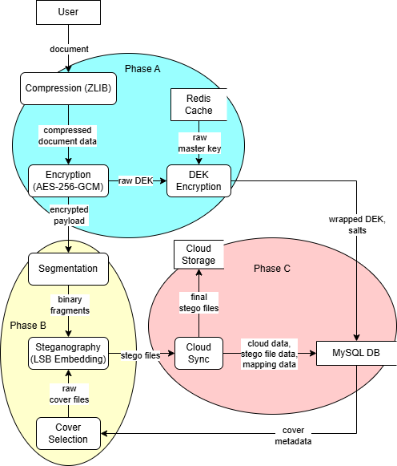
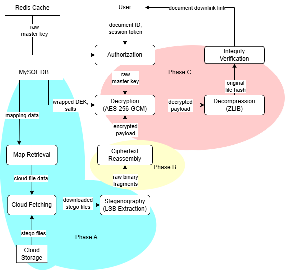
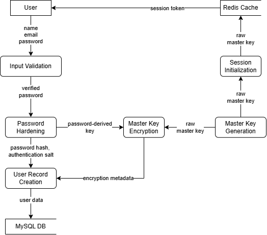
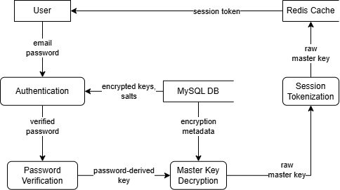
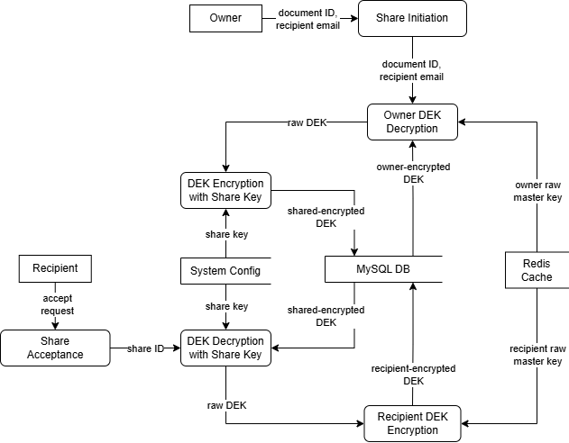
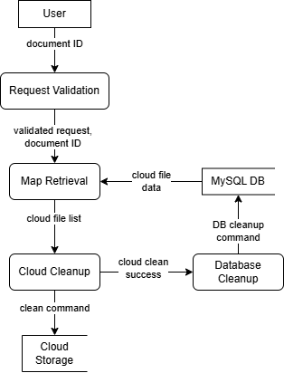

# CHAPTER III
# FRAMEWORK AND METHODOLOGY

This chapter outlines the conceptual framework and methodology for the development of StegoLock, a cloud based web application built on a reconstruction-dependent security model (Figure 9) for digital document storage. The core of this research is the Reconstruction-Dependent Security Model. This model changes the traditional approach to security by moving beyond simply blocking access to a system. Instead, it ensures that data remains private because the information cannot be identified or put back together without the correct digital credentials.

This chapter also explains the design and logic of the system using the Input-Process-Output (IPO) method. This approach shows how sensitive user information is changed into a highly secure and invisible state. These principles guided the researchers in creating an application that follows modern security standards.

## 3.1 CONCEPTUAL FRAMEWORK

The conceptual framework of StegoLock establishes the theoretical and operational boundaries of the research by combining the system's logical data transformations with its comprehensive evaluation metrics. The logical flow of data, illustrated in the StegoLock Conceptual Framework (Figure 1), specifically maps the two core processes of the system: the Document Protection Process and the Document Retrieval Process. Furthermore, the overarching conceptual framework also encompasses the Application System Evaluation Framework, ensuring the system meets established software quality standards. The components of this framework are discussed in the following sections.

Figure 1. StegoLock Conceptual Framework

To operationalize the principles established in the conceptual framework, the system relies on the StegoLock System Architecture (Figure 2), which uses a four-layer design to separate user interaction, application logic, local database storage, and remote cloud storage. This layered approach enforces the reconstruction-dependent security model by completely isolating the database (holding the Stego Map) from the cloud storage (holding the Stego Files). These two critical layers never interact directly; instead, they rely on the System Controller to act as a secure bridge, ensuring that the three components of reconstruction remain separated to maintain data confidentiality.

Figure 2. StegoLock System Architecture

The first layer is the Presentation Layer, pertaining to the User Interface. This client-facing layer is built using React and driven by Inertia.js. This layer serves as the user's visual portal to the system, abstracting away the underlying cryptographic complexity. Its core operation provides the interface for user registration and login, document uploading and its subsequent locking, document sharing, and the final unlocking and downloading of secured documents. Furthermore, regarding its security boundaries, no raw cryptographic processing or data segmentation occurs in the client's browser. All sensitive operations are delegated securely to the backend (Layer 2) to prevent client-side tampering.

The second layer is the Application Logic Layer, acting as the System Controller. This is the core operational layer, serving as the system's central nervous system. It is composed of two distinct subsystems that control the flow of data. Within this layer, the Laravel (PHP) subsystem acts as the primary controller. It manages user authentication, performs secure key derivation to generate the cryptographic keys, executes the AES-256-GCM cryptography and data segmentation, and handles the Cloud API orchestration for uploading and fetching files. Working in tandem, the Python-based steganographic system is invoked dynamically by Laravel. This specialized subsystem handles the specific computational workloads for executing the multi-format steganographic embedding and extraction processes.

The third layer is the Persistence Layer, which functions as the local database. Powered by MySQL, this internal layer is dedicated to structural metadata and identity management. Its primary role is to house user credentials, general document metadata, data regarding the cover media pool, and crucially, the fragment and stego file mapping metada, which serves as the structural blueprint required for reassembly. To maintain the Reconstruction-Dependent Security Model, this database layer enforces a strict isolation constraint. It never stores the actual encrypted payload or the document encryption keys, ensuring that a database compromise yields only reassembly instructions without the actual data to reassemble.

The fourth layer is the Storage Layer, utilizing cloud infrastructure for secure file hosting. Powered by Backblaze B2, this external layer is dedicated to scalable storage. It acts as the repository for the clean cover media pool and strictly houses the stego files, which are the ordinary-looking media files that secretly contain the encrypted document fragments. Similar to the Persistence Layer, the Storage Layer operates under a strict isolation constraint. The cloud bucket possesses no knowledge of the stego map, user identities, or how individual fragments relate to one another. It merely stores flat, isolated binary objects, relying entirely on the System Controller to act as the secure bridge.

Finally, to validate the effectiveness of these interconnected layers and processes, the conceptual framework incorporates an evaluation approach based on the ISO/IEC 25010 software product quality model. This ensures that the resulting application is rigorously assessed for functional suitability, security, reliability, performance efficiency, and usability.

To further understand how the StegoLock framework transforms data across these layers, the system's operations are broken down into logical subprocesses. These are detailed in the following sections through the structural data flows of the locking and unlocking sequences.

### 3.1.1 STEGOLOCK DOCUMENT PROTECTION PROCESS

The StegoLock Document Protection Process defines the forward transformation of data from a vulnerable plaintext document into a secured, reconstruction-dependent state. While the high-level inputs, processes, and outputs are outlined in the overarching conceptual framework, Figure 3 details the actual data flow and layer-by-layer execution of this locking sequence. 

Figure 3. StegoLock Document Locking Process

To execute this protection mechanism, the sequence begins when an authenticated user uploads a primary payload (the original sensitive document). Because the user is already logged in, the system utilizes the active session's master key to authorize the operation. The data immediately enters **Phase A (Cryptographic Transformation)**, which begins with the compression of the document to minimize its footprint. Following this, a unique Document Encryption Key (DEK) is generated to encrypt the payload via AES-256-GCM, and that DEK is then securely wrapped using the master key. 

Following this, the system enters **Phase B (Steganographic Obfuscation)**, where the steganographic engine takes over to segment the resulting ciphertext. These encrypted fragments are then embedded into a diverse pool of cover media (such as PNG, WAV, and TXT files) provided by the system. 

Finally, the process concludes with **Phase C (Storage and Mapping)**. As the physical obfuscation finishes, the system simultaneously constructs the Stego Map (Component 2), a structural blueprint detailing the fragment IDs and their reassembly order, which is saved locally to the database. The system then scatters the resulting Stego Files (Component 3) into a remote cloud bucket. This final step completely separates the generated components by keeping the blueprint in the local database while the hidden data resides in the cloud. This process ensures strict physical isolation in accordance with the security model.

### 3.1.2 STEGOLOCK DOCUMENT RETRIEVAL PROCESS

While the locking sequence focuses on segmentation and obfuscation, the StegoLock Document Retrieval Process operates entirely around the principle of data reconstruction. Building upon the logical structure outlined in the conceptual framework, Figure 4 demonstrates the actual data flow and corresponding unlocking sequence executed across the system's architecture. Rather than generating new materials, this process focuses strictly on validation, extraction, and mathematical reversal.

Figure 4. StegoLock Document Unlocking Process

The unlocking sequence is initiated when a user requests to retrieve a secured document. The system first validates the user's authority by confirming the presence of the active session's master key (Component 1). With authorization granted, the system initiates **Phase A (Retrieval and Extraction)** by querying the local database to retrieve the critical Stego Map, which acts as the blueprint for the entire operation. Using the structural coordinates found within this map, the system connects to the cloud to fetch the specific Stego Files that contain the hidden data, and extracts the hidden fragments from the cover media.

With all components successfully aggregated and extracted, the system moves to **Phase B (Ciphertext Reassembly)**. Guided by the map's indexing data, it organizes the disorganized pieces back together in their exact original sequence to form a unified ciphertext. 

Finally, the system executes **Phase C (Cryptographic Reversal)** by using the master key to unwrap the internal document key, decrypting the data, and decompressing the payload. Because this entire reconstruction process operates strictly within temporary memory, the bit-perfect original plaintext document is safely delivered directly to the user for immediate download without leaving any readable trace behind.

### 3.1.3 STEGOLOCK FUNCTIONAL FEATURES

Beyond the core locking and unlocking sequences, the StegoLock system relies on several other functional processes to manage user identities and document access. The following processes illustrate how user interactions cascade across the system's layers to enforce security.

Figure 5. StegoLock User Account Creation Process

Figure 5 maps the initial point of interaction within the StegoLock system, which is the creation of a user account. This process begins at the Presentation Layer, where the user securely submits their registration details without any sensitive key generation occurring in the client's browser. Once submitted, the Application Logic Layer intercepts the request to generate unique cryptographic identities, establishing a distinct master key and random salts for the user. Finally, the Persistence Layer stores these related user data and securely wraps master key and encryption data to the database. By strictly avoiding the storage of plaintext passwords or raw cryptographic keys, the system ensures that any database breach would yield only useless, inaccessible data.

Figure 6. StegoLock User Login Process

The login process, outlined in Figure 6, requires the user to input their credentials at the Presentation Layer to access the system. The Application Logic Layer then verifies these credentials by deriving the necessary keys to unwrap the user's encrypted master key. Upon successful authentication, this master key is temporarily cached in a secure, short-lived session to authorize subsequent cryptographic operations. Throughout this process, the Persistence Layer acts as the verifier, supplying the stored identity records against which the incoming credentials are cross-referenced.

Figure 7. StegoLock Document Sharing Process

As outlined in Figure 7, users can securely share documents by simply selecting a recipient at the Presentation Layer. To keep the system efficient and secure, the Application Logic Layer does not create duplicate copies of the heavy Stego Files in the cloud. Instead, it temporarily unwraps the document's hidden key using the owner's master key and securely re-wraps it specifically for the recipient. The Persistence Layer then records this shared access in the database. This allows the recipient to use their own master key to unlock the document, without altering the original files stored in the cloud.

Figure 8. StegoLock Document Deletion Process

Finally, Figure 8 illustrates how a document is permanently deleted from the system. When a user chooses to delete a file at the Presentation Layer, the Application Logic Layer makes sure no hidden data is left behind by following a strict "cloud-first" rule. It connects to the Storage Layer to completely delete the Stego Files from the cloud. Only after confirming that these cloud files are truly gone will the Persistence Layer delete the Stego Map and the document's records from the database. Deleting the files in this specific order guarantees that all data is completely wiped out without leaving any broken or leftover pieces behind.

To sum it all up, the following list highlights how the complex background processes discussed previously power the actual features users interact with inside the StegoLock application:

*   **User Registration:** Securely creating an account and generating the user's unique digital keys behind the scenes.
*   **User Authentication:** Verifying the user's identity at login so they can safely lock, unlock, and share their files.
*   **Upload (Document Locking):** Taking a normal file, encrypting it, breaking it into pieces, and hiding those pieces in the cloud.
*   **Download (Document Unlocking):** Finding the hidden pieces in the cloud, putting them back together, and decrypting them to restore the original file.
*   **Document Sharing:** Giving a designated recipient a secure key to open a file without having to make a second heavy copy in the cloud.
*   **Document Deletion:** Using a "cloud-first" approach to completely and permanently wipe out a file's pieces from the cloud before deleting its records from the database, ensuring absolutely nothing is left behind.

### 3.1.4 THE RECONSTRUCTION-DEPENDENT SECURITY MODEL

While the functional data flows illustrate how StegoLock handles data, these operations are governed by the system's underlying conceptual foundation. The fundamental principle of StegoLock is security through segmentation and obfuscation. Rather than storing a document as a single file, the system breaks the encrypted data into small fragments and hides them inside everyday media (images, audio, and text). These Stego Files are subsequently scattered into a remote cloud bucket.

As illustrated in Figure 9, to reconstruct the original document, the system relies on three components that must be accessed simultaneously:

1. **The Master Key:** This is a digital key derived from the user’s password. It serves as the unique credential required to unlock the document’s internal encryption key once the scattered data fragments have been reassembled.
2. **The Stego Map:** This serves as a digital blueprint stored within the system’s database. It maintains a precise record of which hidden data fragments belong to a specific document and the exact order required for reassembly.
3. **The Stego Files:** These are the physical cover media (such as images, audio, or text files) stored in the cloud. To an unauthorized party, these appear as ordinary media files, yet they secretly contain the encrypted data fragments.

Figure 9. The Reconstruction-Dependent Security Model

**System Security:** These three components are functionally interdependent. If an unauthorized party accesses the files without the map, the correct data cannot be identified. If the map is accessed without the master key, the data remains encrypted and unreadable. Successful reconstruction requires the simultaneous presence of all three elements. This model ensures that an attacker cannot find or rebuild the original data unless they have simultaneous access to the encryption keys, the map of the hidden pieces, and the encrypted data fragments stored in the cloud. This model serves as the underlying conceptual model upon which the entire StegoLock framework is built.

### 3.1.5 APPLICATION SYSTEM EVALUATION FRAMEWORK

While the preceding sections define the theoretical design and operational flow of StegoLock, the final component of the conceptual framework establishes how the system's actual quality is measured. StegoLock was evaluated using the ISO/IEC 25010 software product quality model, assessing five core characteristics: functional suitability, performance efficiency, usability, reliability, and security. The evaluation was conducted by deploying the system to a live hosting environment and inviting 30 respondents to participate. The sample size was strategically capped at 30 individuals to accommodate the data thresholds of the system's cloud storage infrastructure, ensuring each participant was allocated a stable 300MB testing quota without exceeding the environment's storage limits. Drawn from the study’s identified target beneficiaries, the participants consisted exclusively of college students. Participants were provided with a structured set of instructions to explore and interact with the application's core features. Following this guided interaction, respondents evaluated their experience by completing a survey questionnaire utilizing a 5-point Likert scale (ranging from 1 = Strongly Disagree to 5 = Strongly Agree). This survey-based methodology ensured that the assessment of the software's overall quality was grounded in practical usage and direct end-user experience. Also, the survey questionnaire used in the evaluation was adapted from a validated material used by Lusiani and Princes on their application system evaluation in Indonesia, which was also based on ISO 25010 quality model [131].

Figure 10. ISO/IEC 25010 Quality Characteristics used for Evaluating StegoLock [132]

#### Functional Suitability

Functional suitability was evaluated to determine whether StegoLock provides the necessary functions to meet the stated and implied needs of its users under specified conditions. The evaluation covered three sub-characteristics defined under ISO/IEC 25010: functional completeness, which gauged whether users found all necessary features to be present; functional correctness, which measured whether the system accurately produced expected outputs during user interaction; and functional appropriateness, which assessed whether the implemented functions were well-suited to the tasks they were designed to accomplish. Respondents evaluated observable core operations, such as document uploading, document retrieval, and verifying the availability of their locked files within the application. Although the backend steganographic embedding and direct cloud storage operations are invisible at the presentation layer, their functional success was implicitly validated when users confirmed their files were successfully processed and made available.

#### Security

Given the nature of StegoLock as a security-oriented application, this characteristic was treated with particular rigor. Security was assessed across five sub-characteristics: confidentiality, which examined whether user data and document contents remained inaccessible to unauthorized parties; integrity, which verified that data could not be modified or corrupted without detection; non-repudiation, which assessed whether system actions could be traced and confirmed; accountability, which evaluated the extent to which user actions were logged and traceable; and authenticity, which determined whether the system reliably verified the identities of its users before granting access. Because the underlying cryptographic and steganographic processes operate in the backend, security was assessed based on the respondents' interaction with observable controls—such as user authentication mechanisms—and their overall perceived trust in the system's ability to protect their documents.

#### Reliability

Reliability was evaluated to determine the degree to which StegoLock performs its intended functions under specified conditions over a defined period of time. The assessment addressed three sub-characteristics: maturity, which gauged how often the system experienced failures under normal operating conditions; availability, which measured the proportion of time the system was operational and accessible to users; and fault tolerance, which examined the system’s capacity to maintain acceptable service levels even when encountering unexpected errors. This evaluation focused on whether the application remained stable, accessible, and error-free throughout the users' sessions, providing a practical measure of how consistently StegoLock operates in real-world scenarios.

#### Performance Efficiency

Performance efficiency was evaluated to assess how well StegoLock performs relative to the amount of resources used under stated conditions. The assessment focused on three specific sub-characteristics: time behavior, which evaluated the system's responsiveness, processing speeds, and the absence of noticeable latency during user actions; resource utilization, which gauged whether users encountered any performance bottlenecks or unexpected application closures; and capacity, which assessed the system's overall compatibility and its ability to operate smoothly across the respondents' various devices. Ultimately, this evaluation captured the users' direct perception of how swiftly and reliably the application handled document operations, ensuring that the system's backend resource management translated into a seamless frontend experience.

#### Usability

Usability was evaluated to determine the degree to which StegoLock allows users to achieve their goals with effectiveness, efficiency, and satisfaction. The assessment covered five key sub-characteristics: appropriateness recognizability, which assessed whether users could easily recognize and remember the application's core functions; learnability, which measured the overall ease of use for first-time users; operability, which evaluated how intuitively respondents could navigate and control the system's features; user interface aesthetics, which gauged the visual attractiveness, organization, and user-friendliness of the presentation layer; and accessibility, which determined the ease and reliability with which the system could be accessed across various scenarios. By assessing these practical elements, the evaluation ensured that the system's interface and workflow were validated directly against the expectations and overall satisfaction of the end-users.

## 3.2 METHODOLOGY

### 3.2.1 DEVELOPMENT METHODOLOGY

Figure 11. Agile Methodology

The creation of StegoLock utilized an Agile approach structured around brief iterative sprints, allowing the team to adapt to new insights and continuously enhance the system. Through implementing features in cycles and performing ongoing testing, the team upheld high standards of quality and security throughout the entire project [115], [116]. This methodology was especially appropriate for the complexity of StegoLock, owing to the necessity of integrating various interrelated components such as AES-based encryption, KDF-based key management, steganographic embedding, encrypted file segmentation, access control and authentication, document sharing mechanisms, cloud storage, and a web-based interface — into a single cohesive and evaluated system.

#### Sprint Structure

The team planned to organize work into two-week sprints, with each cycle covering requirements gathering, implementation, and testing of a specific set of features. At the start of each sprint, the team selected user stories from the backlog, estimated the effort required, and agreed on what would be delivered by the end of the cycle. However, due to time constraints and the increasing complexity of integrating multiple security-critical components — such as implementing the KDF-based key management process, steganographic embedding pipeline, and cloud storage mechanisms — sprint durations were adjusted as needed to ensure that each component was thoroughly developed, tested, and validated before the next layer of the system was built on top of it. Brief discussions were held as needed to keep everyone aligned and surface any issues before they could delay progress.

#### Feature Development Process

Every feature underwent a uniform pipeline before being deployed to production. The process commenced with gathering requirements and reviewing the architecture, followed by implementation and a series of tests that included unit, integration, security, and functional accuracy checks, before moving on to code reviews and staging deployments prior to production. Security validation was integrated into this pipeline rather than being added afterward, ensuring that cryptographic operations, key management logic, access control mechanisms, and input validation were confirmed at each stage of development. This approach directly aligned with the system's aim of applying a reconstruction-dependent security model, where each component — encryption, segmentation, steganographic embedding, and cloud storage — operates correctly both on its own and as part of a cohesive system.

#### Testing Strategy

The testing strategy was designed to validate StegoLock across all four objectives of the study. Unit tests verified the correctness of individual components including AES-GCM encryption and decryption, PBKDF2 and HKDF key derivation, document segmentation, steganographic embedding and extraction, and cloud storage operations. Integration tests confirmed that these components functioned correctly when combined — verifying the full pipeline from document upload through encryption, segmentation, embedding, cloud scatter, retrieval, reconstruction, and decryption back to the original file. Furthermore, security testing addressed the reconstruction-dependent security model directly — verifying that incomplete segment sets cannot be reconstructed, that incorrect keys cannot decrypt ciphertext, that stego files yield no readable content without extraction, and that authenticated session expiry correctly invalidates master key access. Usability testing was conducted with representative users to evaluate the accessibility and ease of use of the web interface, measuring usability as a quality characteristic consistent with the ISO/IEC 25010 evaluation framework alongside functional suitability, security, reliability, and performance efficiency.

#### Continuous Integration/Continuous Deployment (CI/CD)

Changes were deployed to the production environment incrementally as features were completed and verified, allowing the team to validate each component of the system in a real environment before proceeding to the next development cycle. Throughout development, unit and integration tests were conducted regularly to verify the correctness of individual components and the integrity of their interactions across the system. Changes that passed all unit and integration tests were deployed directly to the production environment, ensuring that all implemented features remained functional, secure, and aligned with the system's objectives throughout the development lifecycle. Features that passed all functional, security, and usability evaluation criteria were promoted to production. This process ensured that the integration of StegoLock's security-critical components remained stable and verifiable at every stage of development.

#### Security-First Development

Security was a foundational priority from the beginning of development rather than an afterthought. Code reviews focused specifically on cryptographic correctness, key management logic, access control enforcement, and user input validation. Security was enforced through the system's reconstruction-dependent security model and code implementation, with manual testing conducted to validate critical attack scenarios — including key exposure, unauthorized segment retrieval, stego files interception, and session hijacking — ensuring that security controls were in place at the most critical points in the system. Independent security audits provided additional validation of the implemented controls [120].

#### Iterative Refinement

Throughout development, findings from testing and real-world usage were continuously incorporated into the codebase. Identified bugs and performance bottlenecks were resolved within subsequent sprints, while profiling results guided optimization of computationally intensive operations including KDF iteration, AES-GCM encryption of large files, steganographic embedding, and cloud storage interactions. Cryptographic parameters and steganographic methods were reviewed and adjusted as needed throughout development to ensure the system remained aligned with established security standards and best practices. This continuous refinement process ensured that StegoLock remained technically current, efficient, and aligned with its security and usability objectives throughout the development lifecycle [120].

## 3.3 ETHICAL CONSIDERATION

### 3.3.1 CORE PURPOSE AND DEVELOPMENT ETHICS

StegoLock was designed to safeguard sensitive documents against unauthorized access, with a clear ethical mandate that it is not intended to conceal illicit activities. Throughout the development and testing phases, the researchers strictly utilized synthetic data and publicly available test files. Because no actual personal or organizational data was processed during system development, the research process remained low-risk and ethically grounded. The application’s intended use cases are strictly legitimate, focusing on protecting business records, safeguarding personal privacy, and providing a secure channel for authorized information sharing.

### 3.3.2 PRIVACY BY DESIGN

StegoLock incorporates a "privacy-by-design" architecture, ensuring that cryptographic keys, document contents, and user credentials are never transmitted or stored in plaintext. The system does not persist user passwords; rather, they are utilized solely for the derivation of cryptographic keys. During active sessions, the Master Key and Document Encryption Keys (DEKs) are generated on-demand, reside exclusively in volatile memory, and are immediately purged upon task completion. This approach eliminates the vulnerability of long-term key storage, significantly reducing the attack surface and mitigating the risk of static key store compromises.

### 3.3.3 SECURITY CONTROLS AND RESPONSIBLE USE

To facilitate secure information handling and deter misuse, StegoLock enforces strict access controls, limiting system functionality entirely to authenticated and authorized users. Furthermore, the system incorporates activity monitoring for document operations, ensuring user accountability. These tracking measures allow system administrators to observe access patterns and identify potential anomalies, ensuring the platform is utilized responsibly and in alignment with its core security objectives.

### 3.3.4 PARTICIPANT PRIVACY AND DATA GOVERNANCE

During the evaluation phase involving 30 respondents, strict ethical guidelines were observed to protect participant privacy. All survey feedback was gathered with informed consent, and responses were anonymized to safeguard the identities of the participants. While StegoLock’s underlying architecture aligns with the core principles of standard data protection frameworks (such as data minimization and encryption-in-transit), the study's deployment environment was strictly governed by the researchers. This ensured a safe, responsible, and highly controlled testing environment throughout the evaluation process.