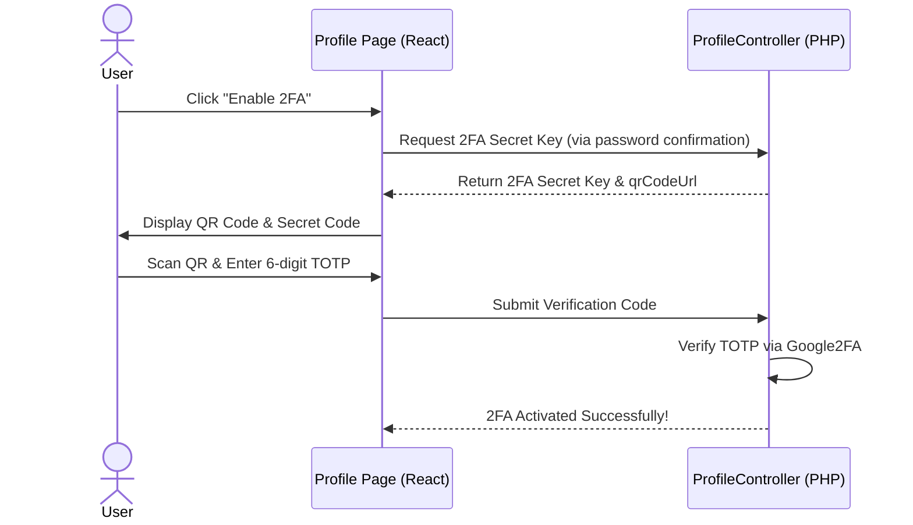
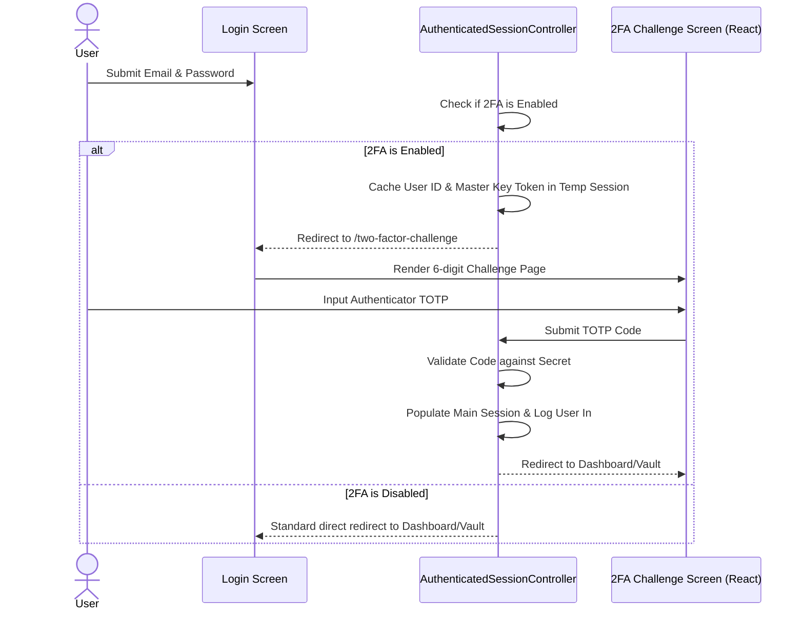

# Implementation Plan - Phase 2: Optional MFA/2FA (TOTP)

This plan details the implementation of an **optional Multi-Factor Authentication (MFA/2FA) via Time-Based One-Time Password (TOTP)**. Once enabled, users will be prompted for a 6-digit authenticator code (e.g., Google Authenticator, Authy, Microsoft Authenticator) during the login process.

---

## 🛠️ Proposed Changes

To maintain clean, secure, and robust state separation, the architecture is divided into three key areas: **Database Modification**, **2FA Setup inside Profile**, and **2FA Challenge on Login**.

### 1. Database & Schema
We need to add fields to the `users` table to securely store the TOTP secret key.

#### [NEW] [2026_05_21_040000_add_two_factor_fields_to_users_table.php](file:///d:/laragon/www/stegolock/database/migrations/2026_05_21_040000_add_two_factor_fields_to_users_table.php)
* Adds `two_factor_secret` (nullable string, containing the encrypted or plain secret key).
* Adds `two_factor_enabled` (boolean, defaults to `false`).

---

### 2. User Profile Setup (Activating 2FA)
We will add a secure Two-Factor Authentication control panel inside the user's Profile page.



#### [MODIFY] [ProfileController.php](file:///d:/laragon/www/stegolock/app/Http/Controllers/ProfileController.php)
* Add `generate2faSecret(Request $request)` endpoint: Requires password confirmation, generates a new 16-character base32 secret using the `pragmarx/google2fa` package, generates the standard `otpauth://` QR link, and returns it to the client.
* Add `enable2fa(Request $request)` endpoint: Accepts a 6-digit TOTP code, validates it, sets `two_factor_secret` and `two_factor_enabled` to true, and flashes a success toast message.
* Add `disable2fa(Request $request)` endpoint: Prompts for password confirmation and valid TOTP code, then clears 2FA fields to deactivate.

#### [MODIFY] [Edit.jsx](file:///d:/laragon/www/stegolock/resources/js/Pages/Profile/Edit.jsx)
* Add a stunning glassmorphism Card titled **Two-Factor Authentication (2FA)**.
* Renders a custom modal to handle 2FA setup:
  * Show QR Code (fetched from `api.qrserver.com` using the secure `otpauth://` URL).
  * Show plain text Backup Code.
  * Render a sleek 6-digit input block (similar to our verification code design) to confirm and complete setup.

---

### 3. Login Flow Integration (The 2FA Challenge Interceptor)
When 2FA is active, standard authentication must halt and prompt the user for their 6-digit code.



#### [MODIFY] [AuthenticatedSessionController.php](file:///d:/laragon/www/stegolock/app/Http/Controllers/Auth/AuthenticatedSessionController.php)
* **Login Attempt interception:** If credentials match, check `two_factor_enabled`.
  * If enabled:
    * Save user credentials/decrypted master key temporarily in a safe temporary session state.
    * Return an Inertia redirect to `route('two-factor.challenge')`.
  * If disabled:
    * Run standard immediate login flow.

#### [NEW] [TwoFactorChallengeController.php](file:///d:/laragon/www/stegolock/app/Http/Controllers/Auth/TwoFactorChallengeController.php)
* **`create`:** Returns the gorgeous `Auth/TwoFactorChallenge` Inertia view.
* **`store`:** Validates the submitted 6-digit authenticator code.
  * If valid, officially logs the user in, populates the primary session (including zero-knowledge keys), clears temp session data, and redirects.
  * If invalid, returns a validation error.

#### [NEW] [TwoFactorChallenge.jsx](file:///d:/laragon/www/stegolock/resources/js/Pages/Auth/TwoFactorChallenge.jsx)
* A high-fidelity, interactive page designed with the same glassmorphism card theme.
* Features custom 6-digit box inputs, focus transition state triggers, and a countdown to remind them that TOTP codes regenerate every 30 seconds.

---

## 📦 Required Package Dependency

To ensure maximum security and adherence to RFC 6238, we will require the standard PHP TOTP implementation package:
* `pragmarx/google2fa` (Runs locally, lightweight, pure PHP).

Command to run:
```bash
composer require pragmarx/google2fa
```

---

## 🧪 Verification Plan

### Automated/Manual Testing Protocol
1. **2FA Activation flow:**
   * Navigate to Profile settings $\rightarrow$ Click **Enable Two-Factor Authentication**.
   * Enter current password to authorize.
   * Scan the generated QR code using Google Authenticator / Authy.
   * Enter the 6-digit code to verify $\rightarrow$ Confirm that 2FA transitions to "Active".
2. **2FA Deactivation flow:**
   * Click **Disable Two-Factor Authentication** in Profile.
   * Verify password and enter current TOTP $\rightarrow$ Confirm that 2FA status deactivates.
3. **Login Interception Challenge:**
   * Log out.
   * Try to log in with 2FA enabled $\rightarrow$ Verify that you are redirected to `/two-factor-challenge` and NOT standard dashboard.
   * Enter incorrect TOTP code $\rightarrow$ Verify that appropriate errors display.
   * Enter correct TOTP code $\rightarrow$ Verify successful activation, loading animation delay, and landing on documents vault.
