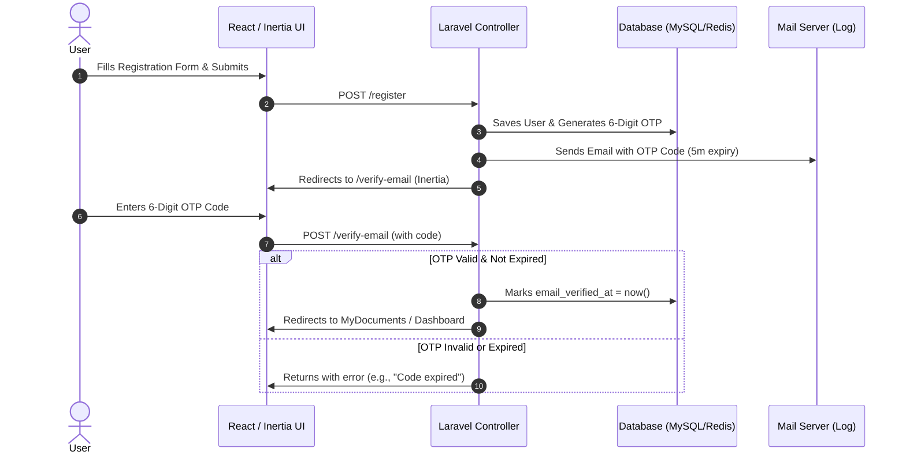

# StegoLock Authentication Enhancements: Email OTP & Optional MFA/2FA

This plan describes the implementation of a mandatory, secure **6-digit Email One-Time Password (OTP) verification** process during registration, followed by an **optional Multi-Factor Authentication (MFA/2FA)** process using Time-based One-Time Passwords (TOTP) in the user's profile settings.

As requested, we will execute this plan **step-by-step, one phase at a time**. We will complete, test, and verify Phase 1 (Email OTP) on your local environment before proposing or starting Phase 2 (Optional MFA/2FA).

---

## 📚 Academic & Industry Justifications for 5-Minute OTP Expiration

To defend this implementation choice in your final thesis or project documentation, here are the key standards-based and empirical justifications for a **5-minute expiration window**:

1. **NIST Special Publication 800-63B (Digital Identity Guidelines: Authentication and Lifecycle Management)**
   * *Section 5.1.3.2 (Out-of-Band Verification):* NIST guidelines state that out-of-band authenticators (such as codes transmitted via SMS or email) MUST have a short lifetime. The recommended expiration is **10 minutes or less**. A 5-minute lifetime is the industry gold standard, balancing the time needed for email transmission against the risk of intercept.
2. **OWASP (Open Web Application Security Project) Cheat Sheet Series**
   * *Authentication Cheat Sheet (OTP Generation):* OWASP recommends that One-Time Passwords (OTPs) have a short expiration window, typically **between 5 and 10 minutes**. A shorter expiration window drastically minimizes the opportunity window for:
     * *Interception & Replay Attacks:* E.g., if a user's mail session or transmission channel is temporarily compromised.
     * *Brute-Force Attacks:* Standard 6-digit codes have 1,000,000 combinations. Limiting the lifespan to 5 minutes restricts the amount of online brute-force guesses an attacker can attempt.
3. **RFC 6238 (TOTP: Time-Based One-Time Password Algorithm)**
   * Industry standards for time-step authentication typically advocate for short windows. While hardware tokens use 30-second intervals, out-of-band email systems extend this to **5 minutes** to gracefully accommodate network latency, SMTP mail server queuing delays, and client fetch rates.

---

## 🛠️ Phase 1: Mandatory Email OTP Verification (Active)

We will replace Laravel's default signed-link verification with a custom 6-digit OTP code sent via email. 

### Proposed Changes (Phase 1)

#### [MODIFY] [User.php](file:///d:/laragon/www/stegolock/app/Models/User.php)
* Implement `MustVerifyEmail` contract: `class User extends Authenticatable implements MustVerifyEmail`.
* Override the standard notification method `sendEmailVerificationNotification()` to generate the OTP, save it to the DB, and send a custom mailable instead of the standard signed notification.

#### [NEW] [EmailOtp.php](file:///d:/laragon/www/stegolock/app/Models/EmailOtp.php)
* Create Eloquent model `EmailOtp` to represent generated OTP codes, mapping `user_id`, `code`, and `expires_at`.

#### [NEW] [create_email_otps_table.php](file:///d:/laragon/www/stegolock/database/migrations/2026_05_21_000001_create_email_otps_table.php)
* Database migration to store OTP codes securely:
  * `id`
  * `user_id` (foreign key pointing to users, cascading)
  * `code` (string, hashed or plain-text since it expires so quickly)
  * `expires_at` (datetime)
  * `timestamps`

#### [NEW] [EmailVerificationOtpMail.php](file:///d:/laragon/www/stegolock/app/Mail/EmailVerificationOtpMail.php)
* A gorgeous, responsive HTML Mailable that styles the 6-digit OTP beautifully with your brand identity (StegoLock) and clearly states the 5-minute expiration limit.

#### [MODIFY] [EmailVerificationPromptController.php](file:///d:/laragon/www/stegolock/app/Http/Controllers/Auth/EmailVerificationPromptController.php)
* Check if a valid, unexpired OTP already exists for the user. If not, automatically generate and send a new OTP.
* Render the custom `/verify-email` Inertia screen.

#### [MODIFY] [VerifyEmailController.php](file:///d:/laragon/www/stegolock/app/Http/Controllers/Auth/VerifyEmailController.php)
* Handle the `POST` request from the OTP entry form.
* Validate that the submitted 6-digit code matches the active database code and that `now() < expires_at`.
* If valid:
  * Mark user as verified (`$user->markEmailAsVerified()`).
  * Delete the used OTP code.
  * Redirect to `myDocuments`.
* If invalid/expired:
  * Return with a validation error.

#### [MODIFY] [EmailVerificationNotificationController.php](file:///d:/laragon/www/stegolock/app/Http/Controllers/Auth/EmailVerificationNotificationController.php)
* Handle the "Resend OTP Code" request.
* Generate a new 6-digit OTP, update/create the record in the DB, send the mail, and return a success notification.

#### [MODIFY] [VerifyEmail.jsx](file:///d:/laragon/www/stegolock/resources/js/Pages/Auth/VerifyEmail.jsx)
* Build a premium, dark-mode/glassmorphism UI for entering the 6-digit code.
* Use separate digit input blocks (automatically moving focus to the next field as the user types) for a high-quality feel.
* Add a real-time countdown timer showing the 5-minute validity window.
* Render a stateful "Resend Code" button that remains disabled until the countdown finishes or allows resending if expired.

---

## 🛠️ Phase 2: Optional TOTP MFA/2FA (Draft - Pending Phase 1 Completion)

After Phase 1 is fully running and verified, we will introduce:
1. **Profile Settings Toggle:** Enable/Disable 2FA.
2. **Setup Modal:** Displays QR Code and recovery codes. Requires entering the first code to verify correct configuration before activation.
3. **Login Interception Middleware/Controller:** If a user has 2FA enabled, they are redirected to a second-factor login screen after successfully verifying their password and before their master key is completely active.

---

## 🧪 Verification & Testing Plan for Phase 1

### Manual Verification
1. **Registration Flow:**
   * Register a new user at `http://localhost/register`.
   * Verify they are redirected to the `/verify-email` page.
   * Check `storage/logs/laravel.log` to view the beautiful HTML email showing the 6-digit OTP.
   * Verify that the countdown timer displays and decreases correctly.
2. **OTP Validation Rules:**
   * Enter an invalid code (e.g., `123456`) and verify the error message appears.
   * Wait 5 minutes (or manually change `expires_at` in the database to 10 minutes ago) and verify that entering the correct code returns an "Expired code" error.
   * Enter the correct, active 6-digit code and verify that the user is logged in, verified, and successfully redirected to the `myDocuments` view.
3. **Resend OTP Flow:**
   * Click "Resend OTP".
   * Check `storage/logs/laravel.log` for the new code.
   * Verify that the previous code is invalidated and only the new code works.
